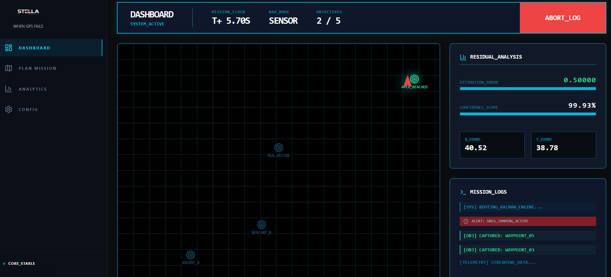
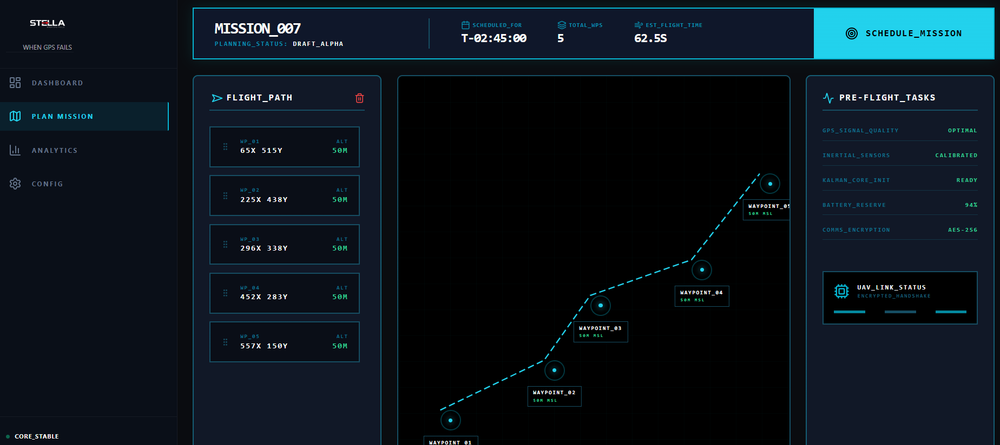

# Project STELLA


## GPS-Jammed Autonomous Navigation

## Problem Statement

**Problem:**  
Enemy jamming or spoofing disables GPS signals, causing loss of absolute position reference while the mission must continue.

**Challenge:**  
Enable an Unmanned Aerial Vehicle (UAV) to complete a waypoint-based mission using only GPS-denied onboard sensors.

**Core Requirements:**

- Visual odometry (optical flow)
- IMU + Barometer fusion
- Compass (magnetometer)
- Optional: Pre-loaded map matching

## Overview

**STELLA** is a high-fidelity navigation and mission planning framework for UAVs operating in GNSS-denied or jammed environments.  
The system emphasizes **multi-sensor fusion using Kalman Filter algorithms** to estimate position, velocity, and heading without relying on GPS.


STELLA provides:

- Real-time navigation estimation
- Mission-level planning and visualization
- Post-mission performance analysis
- Robust behavior under electronic warfare conditions

## System Architecture

### 1. Mission Planner


The Mission Planner module enables operators to define and validate flight missions.

**Features:**

- **Waypoint Sequencing:**  
  Interactive coordinate selection with altitude (MSL) assignment.
- **Payload Configuration:**  
  Toggles for EO/IR sensors, SAR imagers, and interference modules.
- **Pre-Flight Validation:**  
  Automated checks for:
  - Sensor calibration
  - Battery status
  - Secure communication handshake

### 2. Real-Time Dashboard

Command-and-control interface for live mission monitoring.

**Capabilities:**

- **Spatial Reconstruction:**  
  Real-time plotting of estimated trajectory vs. true trajectory.
- **Residual Analysis:**  
  Continuous tracking of estimation error and filter confidence.
- **System Logs:**  
  Terminal-style telemetry and mission event output.

### 3. Post-Mission Analytics

Debriefing and evaluation tools after mission completion.

**Reports:**

- **Interference Impact Analysis:**  
  Measures signal drift and recovery latency during jamming windows.
- **Stability Metrics:**  
  Tracks Kalman Filter convergence and sensor fusion efficiency over time.

## Technical Specifications

### Navigation Engine

The core estimation engine uses a **Discrete-Time Kalman Filter (DTKF)**.

**State Vector:**

- Position (x, y)
- Velocity (vx, vy)
- Heading (θ)

**State Transition Model:**

- Constant velocity and constant acceleration kinematics

**Noise Mitigation:**

- Dynamic adjustment of Measurement Noise Covariance (R) when interference is detected
- Increased reliance on inertial and vision-based sensors under GPS loss

## Visual Identity

**Primary Colors:**

- Pure White `#FFFFFF`
- Neon Cyan `#22D3EE`

**Secondary Colors:**

- Emerald Green `#10B981`
- Alert Red `#EF4444`

**Background:**

- Obsidian Black `#0A0C10`

Optimized for:

- Low-light operation
- High contrast
- Situational clarity

## Frontend Stack

- **Framework:** React.js
- **Animation:** Framer Motion
- **Visualization:** Recharts (SVG-based plotting)
- **Icons:** Lucide React

## Data Structure

Telemetry is processed in JSON format using the following schema:

```json
{
  "trajectory_data": [
    {
      "time": "float",
      "true_x": "float",
      "true_y": "float",
      "est_x": "float",
      "est_y": "float",
      "error": "float",
      "confidence": "float"
    }
  ],
  "metrics": {
    "mission_success_rate": "float",
    "max_position_error": "float"
  }
}
```
